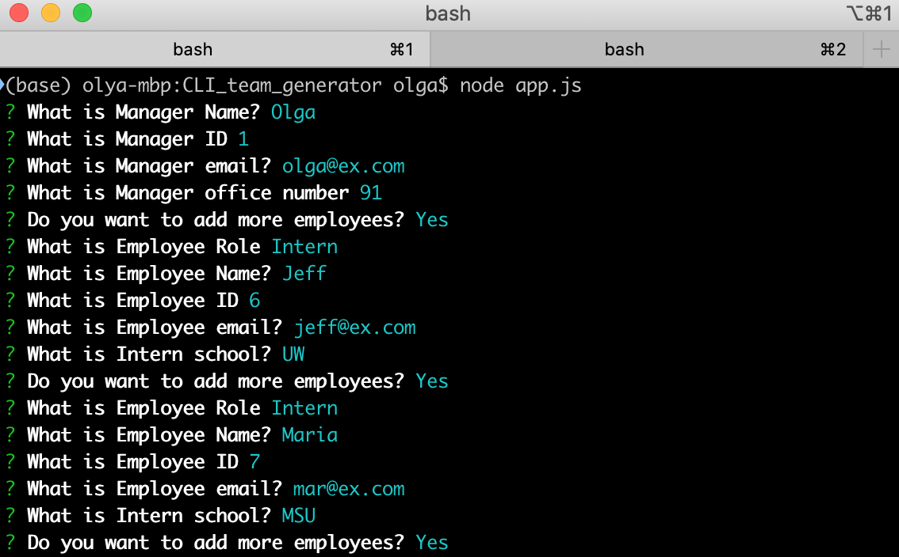
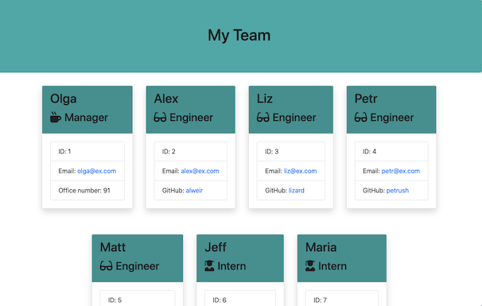
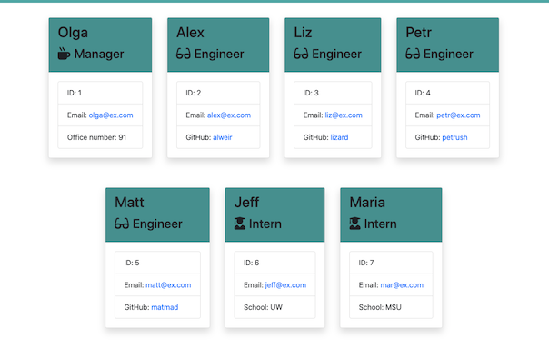

# Team Generator 
  The CLI app that generates web page with basic information about team members.
  # Table of Contents
  1. [Installation](#installation)
  2. [Usage](#usage)
  3. [License](#license)
  4. [Detailed description](#detailed-description)
  5. [Test](#test)
  6. [Files](#files)
  7. [Questions](#questions)
## Installation
To install please use: 
`npm install`
## Usage
To use do next: 
`node app.js`
## License
[License: MIT](https://opensource.org/licenses/MIT)
## Detailed description 
### Command line interface

### Results

### Inner Logic
App generates web page for a team.
Team contains one manager and any number of engineers and interns.
So first, program ask info about manager, and then start asking info about other employers.

Question are different for different roles. 

Then app generates web page that contains all info that user entered.

You can watch video how it works by [link](https://drive.google.com/file/d/1ca4esH0Xqjs23Jf5H-dmDGViUtpRb8GA/view?usp=sharing)

## Test
To test use:
` npm test`
## Files
`app.js` &ndash; main application that prompts questions about team
`lib` &ndash; js modules, contains employees classes and html renderer
`templates` &ndash; html templates for main page, and employees cards
`output` &ndash; directory for output
`test` &ndash; directory with tests
`screenshots` &ndash; screenshots of interface and output

## Questions
For questionts please contact [me](https://github.com/Myau5x) at ola.illari@gmail.com
 

